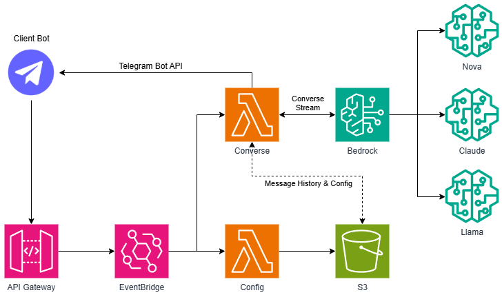

# BedrockBot

This project contains source code and supporting files for a serverless application that you can deploy with the SAM CLI. It includes the following files and folders:

- ```functions``` - Code for the application's Lambda functions to set configuration and converse with the Bedrock Model
- ```template.yaml``` - A template that defines the application's AWS resources.

This application creates a scalable serverless architecture that allows you to converse with multiple Large Language Models through Amazon Bedrock. This source code provides intergration with the Telegram Bot.



When deploying, please go throught the ```template.yaml``` file and key in the necessary details such as BOT_TOKEN, Usernames 